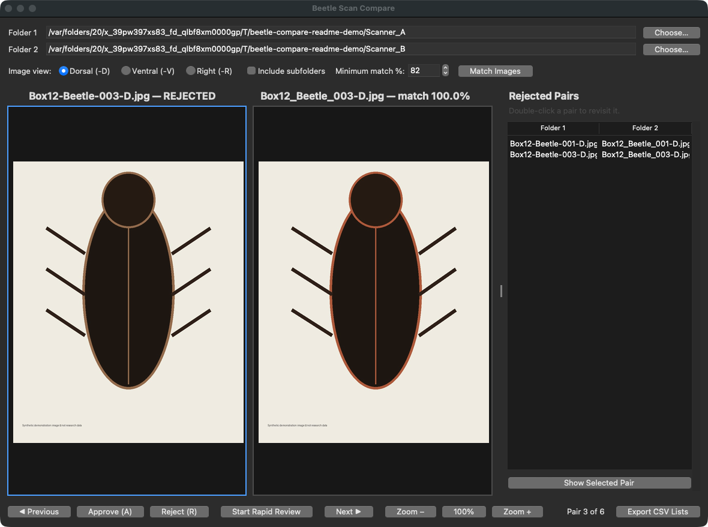
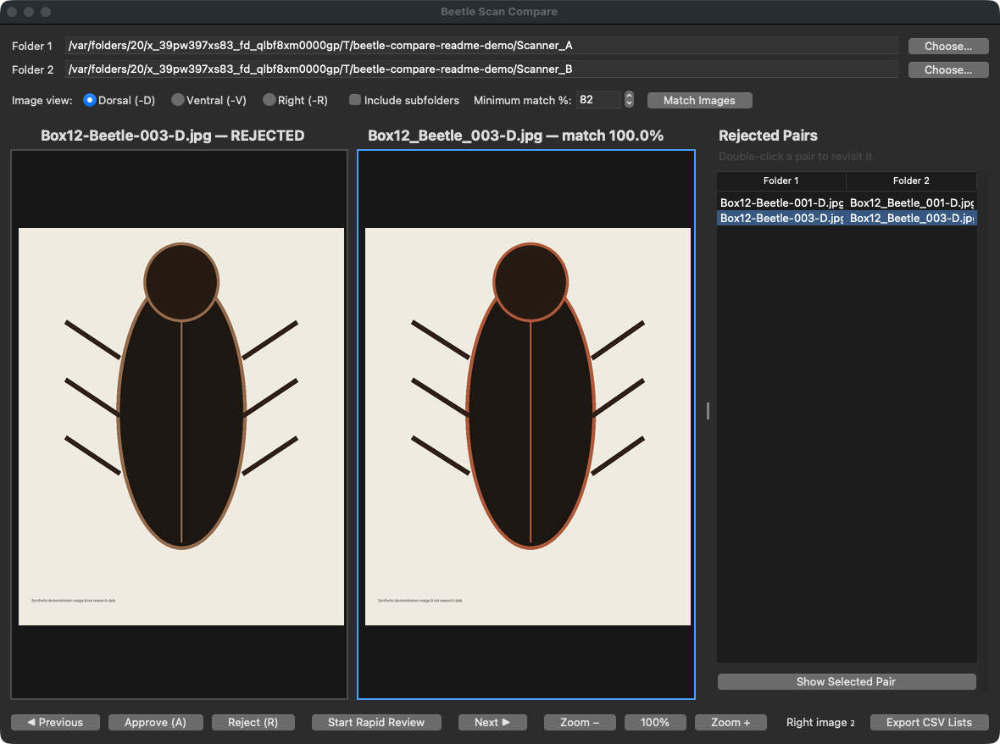

# Beetle Scan Compare

A local Mac desktop program for rapidly comparing two folders of beetle scan
images side by side. It matches close (but not necessarily identical) filenames,
filters to dorsal (`-D`), ventral (`-V`), or right-side (`-R`) images, and records
approve/reject decisions without modifying the source images.



## What it does

- Select any two folders from the GUI.
- Review one matched pair at a time, with both full filenames displayed above
  the images.
- Filter to one anatomical view: dorsal, ventral, or right.
- Start **Rapid Review**, then press **A** to approve or **R** to reject. Each
  decision immediately advances to the next pair.
- Use the left/right arrow keys or onscreen buttons to move through the list.
- Prefetch up to 120 upcoming pairs with four background workers and retain a
  bounded thumbnail cache for sustained rapid navigation.
- Zoom each image independently with the mouse wheel or zoom buttons, and drag
  a zoomed image to pan across fine scan details.
- Keep rejected pairs visible in a right-hand panel and jump back to any
  rejection by double-clicking its filenames.


- Save the in-progress review automatically to the Mac temporary directory.
- Export a complete decision CSV and a separate two-way unmatched-image CSV.
- Leave ambiguous near-matches unmatched rather than silently choosing one.

Source images are read-only. The application does not rename, move, copy, or
delete them.

## Install on a Mac

### DMG installation (recommended)

Download `Beetle-Scan-Compare-0.1.0-Apple-Silicon.dmg`, open it, and drag
**Beetle Scan Compare** into the Applications folder shown in the installer.
The app bundle contains Python, Pillow, and the other runtime components; the
other Mac does not need to install dependencies separately.

The current DMG is for Apple Silicon Macs (M1, M2, M3, M4, or newer). Because
this is an unsigned research build, macOS may require a Control-click on the app
followed by **Open** the first time. Do not bypass a warning for a copy received
from an untrusted source.

### Installation from source

Python 3.10 or newer is required. In Terminal:

```bash
git clone https://github.com/YOUR-USERNAME/beetle-scan-compare.git
cd beetle-scan-compare
python3 -m venv .venv
source .venv/bin/activate
python -m pip install --upgrade pip
python -m pip install .
python -m beetle_compare
```

For a simpler Finder-based setup after downloading the repository:

1. Double-click `setup_mac.command` once.
2. Double-click `run_app.command` whenever you want to launch the program.

On first use, macOS may ask for confirmation before opening a downloaded
`.command` file. These scripts install only the dependencies declared in
`pyproject.toml` and run the local application.

For development and tests, use `python -m pip install -e '.[dev]'`.

## Review workflow

1. Choose Folder 1 and Folder 2.
2. Select **Dorsal (-D)**, **Ventral (-V)**, or **Right (-R)**.
3. Optionally enable subfolder scanning or adjust the minimum filename match
   percentage (default: 82%).
4. Click **Match Images** and inspect the match/unmatched counts.
5. Click **Start Rapid Review**.
6. Press **A** or **R**. Decisions are written after every keypress.
7. To inspect a detail, move the pointer over either image and scroll to zoom.
   Drag the image to pan. The blue outline shows which image the zoom buttons
   control; **100%** returns that image to fit-to-window view.
8. Rejected pairs appear immediately in the panel on the right. Double-click
   one—or select it and click **Show Selected Pair**—to revisit it. Revisiting
   does not change the saved decision; press **A** if you want to change it.
9. Click **Export CSV Lists** and choose a permanent output folder.

The temporary file is:

```text
/tmp/beetle-scan-compare/current_review.csv
```

macOS may represent `/tmp` as `/private/tmp`; both refer to the same location.
Export before ending a review if you want a permanently named copy.

## How filename matching works

The program:

1. recognizes supported image extensions (`jpg`, `jpeg`, `png`, `tif`, `tiff`,
   `bmp`, and `webp`);
2. keeps only files with a delimited `-D`, `-V`, or `-R` style view marker;
3. removes that marker and punctuation from a normalized comparison key;
4. calculates filename similarity;
5. makes a one-to-one match only when the score exceeds the selected threshold
   and is clearly better than the next candidate from both folders.

This is intentionally conservative. A lower threshold finds more candidates but
also increases false-match risk. Ambiguous and low-scoring files appear in the
unmatched export so they can be audited.

## CSV outputs

`review_decisions_YYYYMMDD_HHMMSS.csv` contains both filenames, match score,
decision (`approved`, `rejected`, or `not_reviewed`), and timestamp.

`unmatched_images_YYYYMMDD_HHMMSS.csv` contains the folder side, full filename,
and reason. It reports missing matches in both directions.

## Project status

This is an alpha research utility. Before relying on a large review, validate a
sample of proposed matches and inspect the unmatched list. See
[CONTRIBUTING.md](CONTRIBUTING.md) for development instructions and
[docs/DESIGN.md](docs/DESIGN.md) for design and data-safety details.

## License

MIT. See [LICENSE](LICENSE).
